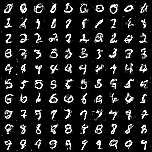
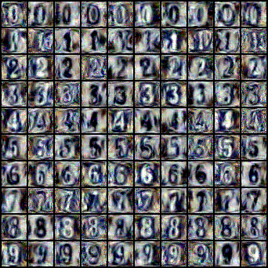
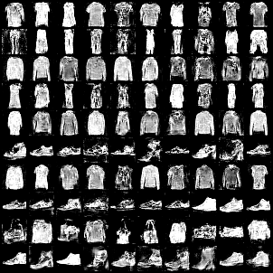
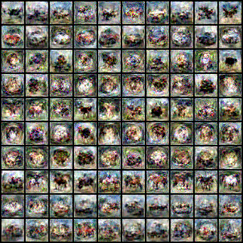

# Dataset Condensation
This repo contains all the codes and documents for EECS 6322 project. In this project, we aim to reproduce the results of [Dataset Condensation with Gradient Matching (ICLR 2021)](https://openreview.net/pdf?id=mSAKhLYLSsl).

|  |  |
|:-----------------------------------------:|:--------------------------------------:|
| MNIST                                      | SVHN                                   |

|  |  |
|:--------------------------------------------------------:|:---------------------------------------------:|
| Fashion MNIST                                             | CIFAR10                                       |

*Four datasets each containing 10 images per class synthesized by ConvNet*

## Contributors
- [Aida Aminian](https://github.com/aidaaminian)
- [Arian Boukani](https://github.com/2arian3)

