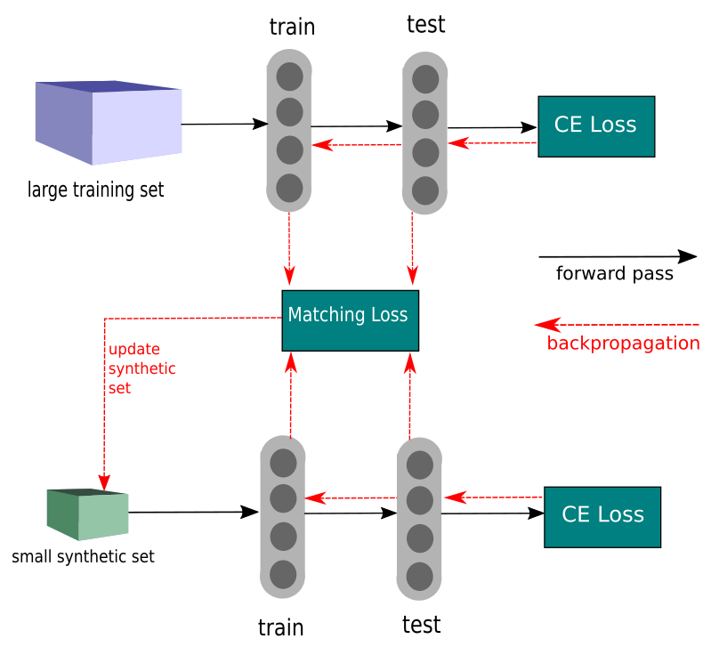

# Dataset Condensation
This repo contains all the codes and documents for EECS 6322 project. In this project, we aim to reproduce the results of [Dataset Condensation with Gradient Matching (ICLR 2021)](https://openreview.net/pdf?id=mSAKhLYLSsl).

## Introduction
Datasets containing millions of samples are increasingly standard for achieving cutting-edge results in machine learning across various domains, such as computer vision, natural language processing, and speech recognition. At this magnitude, merely handling and preparing the data presents challenges, and the process of training machine learning models requires specialized hardware and infrastructure. One potential solution to this issue is to generate a condensed, yet informative dataset from the larger pool, aiming to attain similar accuracy to models trained on the full dataset.

The paper presented an innovative training technique called Dataset Condensation, which synthesizes a small set of informative samples for training deep neural networks. This method reduces computational costs while achieving comparable results to the original data. This goal is formulated as a gradient matching problem between the gradients of a deep neural network weights trained on the original and the synthetic data. In this scenario, as the term gradient matching suggests, the aim goes beyond simply achieving a model similar to one trained on the full dataset. It involves tracking the model's progression over time and attempting to replicate the learning process itself.

A general schema of the procedure is given in the following figure. This method ensures that the condensed dataset captures the important information from the original data.

## Experiments

Both the training and the testing of the proposed model were executed on a single virtual machine hosted on Compute Canada clusters running with an NVIDIA Tesla V100 GPU. The process of creating the datasets, along with training and assessing each specified network using the created data, amounted to approximately 53 hours. This duration covered 48 distinct experiments, stemming from a combination of four datasets, four models, and three varying quantities of images per class. [Here](https://drive.google.com/drive/folders/1GTLlw3WnkC_oaJFCVvsEHZTjiww7Nvp5?usp=drive_link) is a link to all the logs generated during the experiments

|  |  |
|:-----------------------------------------:|:--------------------------------------:|
| MNIST                                      | SVHN                                   |

|  |  |
|:--------------------------------------------------------:|:---------------------------------------------:|
| Fashion MNIST                                             | CIFAR10                                       |

*Four datasets each containing 10 images per class synthesized by ConvNet*

## Contributors
- [Aida Aminian](https://github.com/aidaaminian)
- [Arian Boukani](https://github.com/2arian3)

